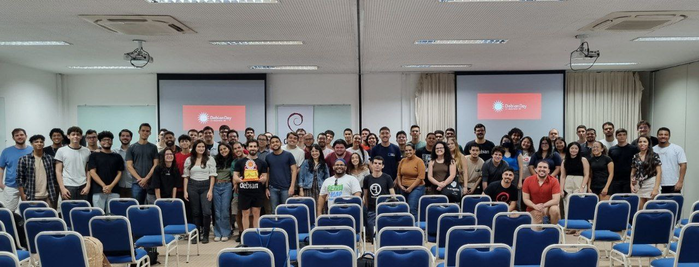

+++
author = "Matheuszin"
title = "Debian Day 2025"
date = 2025-08-16T23:31:15-03:00
description = "Primeiro contato com o Debian"
tags = ["Potilivre", "post", "Software Livre"]
+++

# 🌀 Sobre o evento

O [Debian Day](https://potilivre.org/p/debian-edicao-natal) é um evento internacional que celebra a fundação do projeto Debian e o impacto que ele tem no ecossistema de Software Livre. Acontece todos os anos em diversas cidades do mundo, com o objetivo de:

- Apresentar o Debian a novos usuários;
- Reunir a comunidade local;
- Compartilhar experiências e aprendizados;
- Incentivar contribuições ao projeto.

O evento é celebrado no dia 16/08 ou no final de semana mais próximo a data, por um acaso do destino, o aniversário coincidiu com um sábado, o que contribuiu para a realização do evento na data apropriada.

# 🖖 Minha participação

    
    
&nbsp;

Nesta edição que ocorreu no **SEBRAE-RN** auxiliei na organização como um voluntário da [Potilivre](https://potilivre.org) e tive a oportunidade de participar também como palestrante, onde apresentei introdutoriamente algumas curiosidades quanto ao projeto e como desfrutar das utilidades do Linux, através da ferramenta WSL, sem sair do conforto ou comodidade apreciados pela maioria dos usuários do sistema operacional Windows, a qual exemplifiquei o quão fácil é hospedar a distro Debian.

# 📓 Considerações finais

Foi um evento muito proveitoso, aprendi bastante sobre a comunidade, inclusive como contribuir com a tradução do projeto, foi minha primeira experiência como palestrante, o que despertou um interesse nesta atividade e objetivo de me aprimorar para próximas oportunidades.